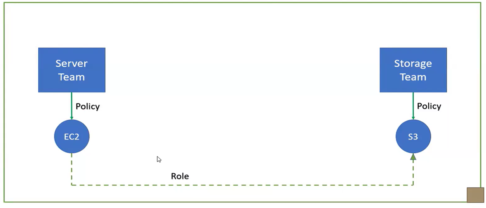
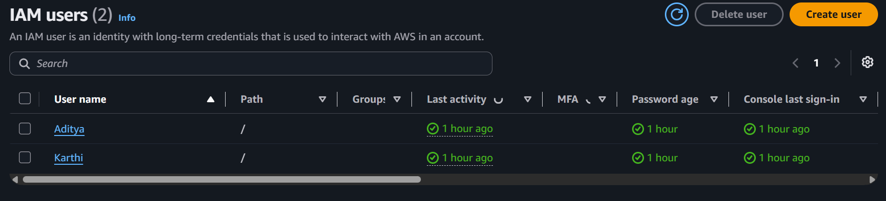
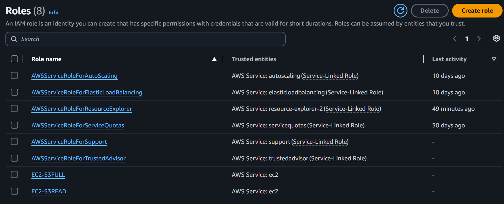
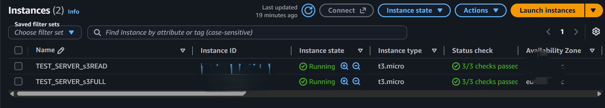
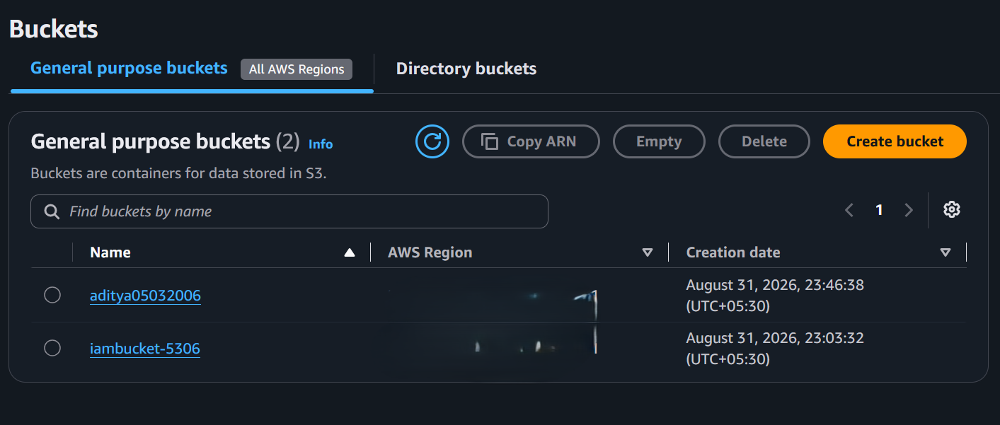
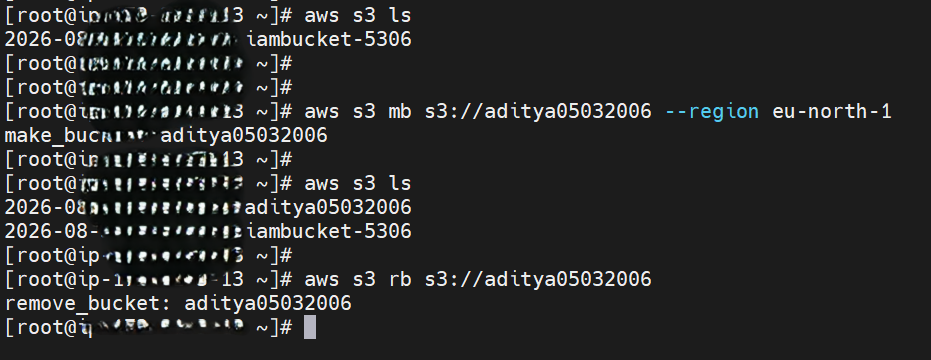
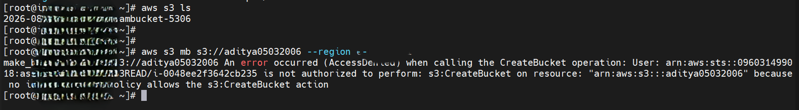
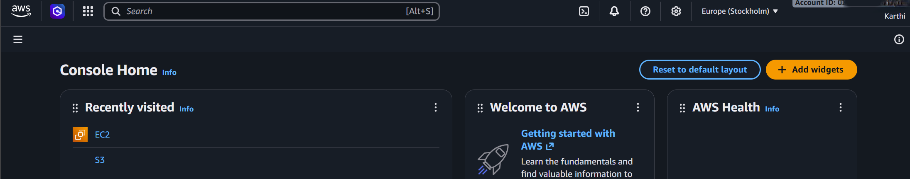
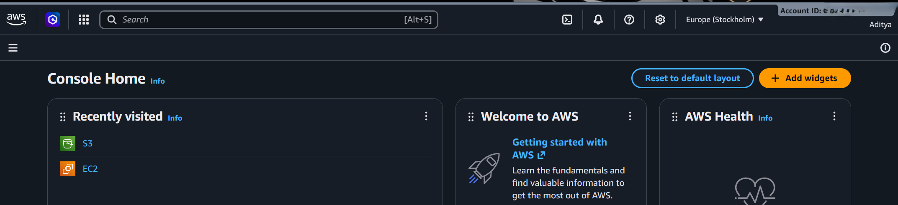

AWS IAM Role-Based Access Control (RBAC) - EC2 to S3

Project Overview

This project demonstrates how to implement secure, role-based access control between Amazon EC2 compute instances and Amazon S3 storage buckets using AWS IAM Users, Groups, Policies, and Roles.

The project is structured around two functional teams:

- Server Team - Responsible for managing compute instances (EC2).
- Storage Team - Responsible for managing storage buckets (S3).

The primary objective is to enforce the Principle of Least Privilege (PoLP) by assigning IAM Roles via EC2 Instance Profiles instead of hardcoding or storing permanent AWS access keys on server workloads.

Services Used

- Amazon EC2 (Elastic Compute Cloud)
- Amazon S3 (Simple Storage Service)
- AWS IAM (Identity and Access Management)
- AWS STS (Security Token Service)
- AWS CLI
- AWS Management Console

Configuration Details

| Parameter | Configuration |
|---|---|
| AWS Region | Europe (Stockholm) eu-north-1 |
| IAM User Groups | Server_Team, Storage_Team |
| IAM Users | Aditya, Karthi |
| IAM Roles | EC2-S3FULL, EC2-S3READ |
| EC2 Instances | TEST_SERVER_s3FULL, TEST_SERVER_s3READ |
| Instance Type | t3.micro (Amazon Linux) |
| S3 Buckets | aditya05032006, iambucket-5306 |

Step 1 - Configure IAM Users and Groups

Created functional user groups to separate administrative duties and assigned individual users to their respective roles:

- Server_Team (Compute administration)
- Storage_Team (Storage administration)
- Users: Aditya, Karthi

Step 2 - Configure IAM Roles and Instance Profiles

Created two IAM service roles with trusted entity permissions for ec2.amazonaws.com:

- EC2-S3FULL - Attached policy: AmazonS3FullAccess
- EC2-S3READ - Attached policy: AmazonS3ReadOnlyAccess

Step 3 - Provision EC2 Instances & Attach Roles

Launched two Amazon Linux EC2 instances in eu-north-1 and attached the respective IAM instance profiles:

- TEST_SERVER_s3FULL (Attached to EC2-S3FULL)
- TEST_SERVER_s3READ (Attached to EC2-S3READ)

Step 4 - Configure S3 Target Buckets

Provisioned general-purpose S3 storage buckets in eu-north-1 to validate access control boundaries:

- aditya05032006
- iambucket-5306

Step 5 - Verify Full Access Operations

Connected to TEST_SERVER_s3FULL via SSH to validate administrative bucket operations (list, create, delete):

Step 6 - Verify Read-Only Restriction & Access Denied

Connected to TEST_SERVER_s3READ to test policy enforcement. Listing buckets succeeded, while unauthorized write requests were blocked by IAM with an AccessDenied error:

Console Access Verification

Verified independent console sign-ins for operational accounts:

Testing & Verification

Verified the following:

- Confirmed that EC2 workloads authenticate securely using short-lived STS tokens instead of static credentials.
- Verified that TEST_SERVER_s3FULL can list, create, and remove S3 storage buckets.
- Verified that TEST_SERVER_s3READ is restricted to read-only actions and denied write privileges with AccessDenied.
- Confirmed separation of duties across Server_Team and Storage_Team IAM groups.
- Validated all operations directly across the AWS CLI and AWS Management Console.

Learning Outcomes

- Configured IAM Users, Groups, and policy boundaries.
- Created IAM Roles and attached Instance Profiles to EC2 workloads.
- Implemented secure service-to-service communication between EC2 and S3.
- Eliminated static AWS API keys in codebases using temporary STS credentials.
- Enforced and validated the Principle of Least Privilege (PoLP) across infrastructure components.

Author

ADITYA MANIVANNAN

AWS Cloud | DevOps Engineer
